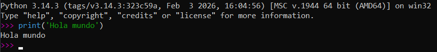
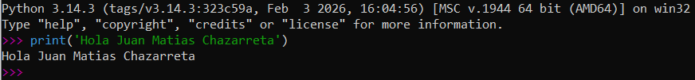
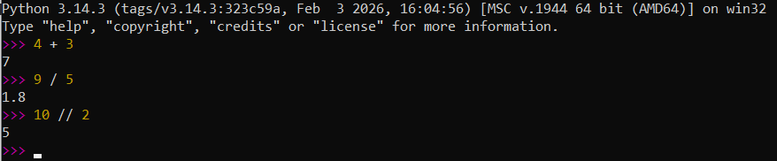
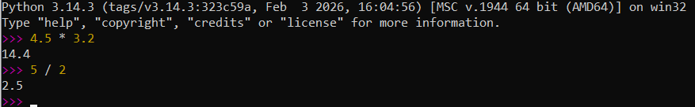
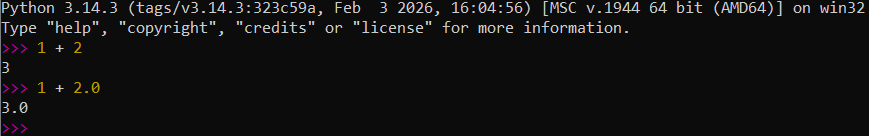
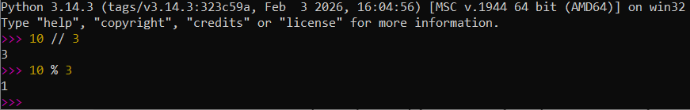
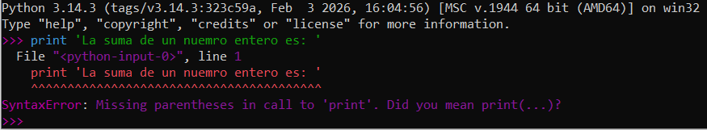
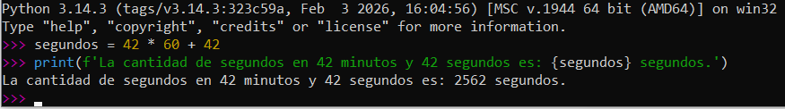
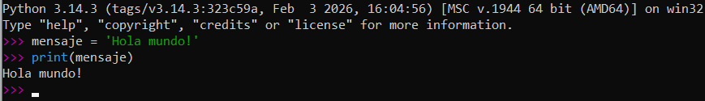
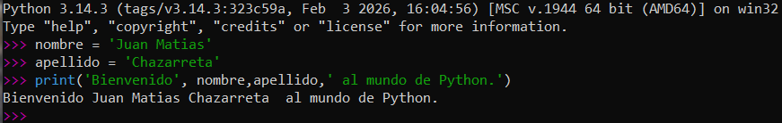

# Mini TP 1: Variables y tipos de datos

> Programacion 1  
> Universidad Nacional de Rio Negro  
> Tema: Variables y tipos de datos en Python

## Objetivo

Practicar el uso del interprete de Python, la creacion de variables y el uso de los tipos de datos basicos: `int`, `float`, `str` y `bool`. Tambien se busca familiarizarse con la ejecucion de programas simples y la interaccion con el servidor compartido.

## Parte 1: Exploracion en el interprete

Abrir el interprete de Python y probar las siguientes operaciones:

1. Imprimir el mensaje `"Hola mundo"` utilizando `print()`.

2. Imprimir el mensaje `"Hola [tu nombre]"`, reemplazando `[tu nombre]` por tu nombre real.

3. Realizar tres operaciones matematicas distintas usando numeros enteros.

4. Realizar dos operaciones con numeros decimales (`float`).

5. Probar que sucede al ejecutar `1 + 2` y luego `1 + 2.0`.

6. Escribir la expresion `10 // 3` y luego `10 % 3`. Explicar brevemente que representa cada resultado.

>  El simbolo // representa la division entera, por lo cual el resultado toma la parte entera de la operacion. 
   El simbolo % representa el resto de la division solicitada. 

7. En una sentencia `print`, probar que ocurre si omitis uno de los parentesis, o ambos. Explicar que ocurre.

>  Ocurre un error de sintaxis, al ser una funcion integrada (a partir de Python 3.0) requiere obligatoriamente el uso de parentesis de incio y cierre.

8. Resolver el siguiente problema: cuantos segundos hay en 42 minutos con 42 segundos.

## Parte 2: Variables y tipos de datos

1. Definir una variable `mensaje` con el valor `"Hola mundo!"` y mostrarla por pantalla.

2. Definir las variables `nombre` y `apellido` y mostrar el mensaje: `"Bienvenido [nombre] [apellido] al mundo Python"`.

3. Crear un programa donde se defina una variable de cada uno de los siguientes tipos: `str`, `int` y `float`. Utilizar `type()` para imprimir, junto con su valor, el tipo de cada variable.
5. Crear un programa donde se asigne un valor a una variable de tipo `int` y otra de tipo `float`, sumarlas y mostrar el resultado, indicando tambien el tipo de dato del resultado.
6. Crear un programa que:
   1. Calcule cuantos meses viviste aproximadamente.
   2. Calcule tu edad dentro de 10 anios.
   3. Calcule el doble de tu altura.
   4. Imprima los resultados con mensajes descriptivos.
7. Crear un programa que:
   1. Cree una variable `saludo` que diga: `"Hola <tu nombre>"`.
   2. Cree otra variable que repita el saludo tres veces.
   3. Cuente cuantas letras tiene tu nombre usando `len()`.

## Parte 3: Un programa de presentacion

Crear un programa de presentacion en un archivo llamado `tp1.py` y definir las siguientes variables:

- Una variable con tu nombre.
- Una variable con tu edad.
- Una variable con tu altura aproximada en metros.
- Una variable booleana que indique si te gusta programar.
- Una variable que, a partir del anio actual y tu edad, calcule tu anio de nacimiento aproximado.

Luego, imprimir toda esa informacion utilizando `print()`.

> Nota: esta parte es opcional. Si llegamos a tiempo en clase, la subimos al servidor compartido. Si no, la dejamos para la proxima clase.

## Parte 4: Entrega en el servidor

En el servidor compartido:

1. Crear una carpeta con tu nombre.
2. Crear o editar con `nano` el archivo `tp1.py` y guardar el programa que escribiste.
3. Verificar que el archivo exista utilizando el comando `ls`.
4. Ejecutarlo con `python tp1.py`.

